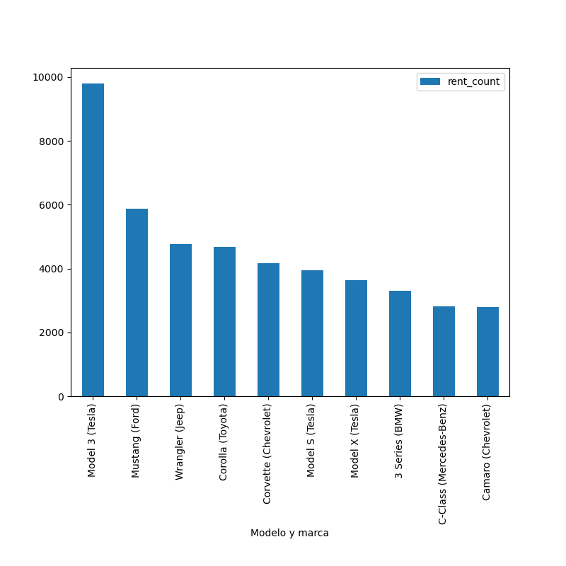
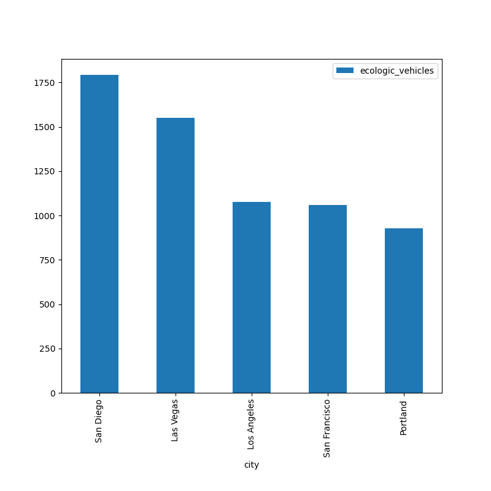

# Examen Final
## Ejercicio 1
Hacer ingest de los siguientes files relacionados con transporte aéreo de Argentina : 

2021: https://data-engineer-edvai-public.s3.amazonaws.com/2021-informe-ministerio.csv


2022: https://data-engineer-edvai-public.s3.amazonaws.com/202206-informe-ministerio.csv


Aeropuertos_detalles:
https://data-engineer-edvai-public.s3.amazonaws.com/aeropuertos_detalle.csv

Esto se realiza en el archivo `~/examen-final/aeropuertos-ingest.sh`

## Ejercicio 2
Las tablas fueron creadas en Hive.

## Ejercicio 3
El dag para orquestar el proceso en Airflow se encuentra en [aeropuertos.py](./dags/aeropuertos.py).

## Ejercicio 4
Realizar las siguiente transformaciones en los pipelines de datos:

- eliminar la columna inhab ya que no se utilizará para el análisis
-​ eliminar la columna fir ya que no se utilizará para el análisis
-​ eliminar la columna “calidad del dato” ya que no se utilizará para el análisis
- Filtrar los vuelos internacionales ya que solamente se analizarán los vuelos domésticos
- En el campo pasajeros si se encuentran campos en Null convertirlos en 0 (cero)
- En el campo distancia_ref si se encuentran campos en Null convertirlos en 0 (cero)

Estas transformaciones se realizan en el archivo [aeropuertos-etl.py](./aeropuertos-etl.py):
```
aeropuertos = aeropuertos.withColumn("clasificacion_vuelo", 
                                     when(col("clasificacion_vuelo") == 'Domestico',
                                                  'Doméstico').otherwise(col("clasificacion_vuelo")))
aeropuerto_detalles = aeropuerto_detalles.drop('inhab', 'fir')
aeropuerto_detalles = aeropuerto_detalles.fillna(0, subset='distancia_ref')
aeropuertos = aeropuertos.drop('calidad_dato')
aeropuertos = aeropuertos.filter(aeropuertos.clasificacion_vuelo == 'Doméstico')
aeropuertos = aeropuertos.fillna(0, subset='pasajeros')
```

5. Schema de las tablas


6.​ Determinar la cantidad de vuelos entre las fechas 01/12/2021 y 31/01/2022. Mostrar consulta y Resultado de la query	

```
SELECT COUNT(*) 
FROM aeropuerto_tabla
WHERE fecha >= '2021-12-01' AND fecha <= '2022-01-31';

OK
57984
```

7.​ Cantidad de pasajeros que viajaron en Aerolíneas Argentinas entre el 01/01/2021 y 30/06/2022. Mostrar consulta y Resultado de la query
```
SELECT SUM(pasajeros)
FROM aeropuerto_tabla
WHERE fecha >= '2021-01-01' AND 
      fecha <= '2022-06-30' AND 
      aerolinea_nombre = 'AEROLINEAS ARGENTINAS SA';

7484860
```


8\. Mostrar fecha, hora, código aeropuerto salida, ciudad de salida, código de aeropuerto de arribo, ciudad de arribo, 
y cantidad de pasajeros de cada vuelo, entre el 01/01/2022 y el 30/06/2022 ordenados por fecha de manera 
descendiente. Mostrar consulta y Resultado de la query.

```
WITH salida AS (
   SELECT aeropuerto, ref
   FROM aeropuerto_detalles_tabla
), arribo AS (
   SELECT aeropuerto, ref
   FROM aeropuerto_detalles_tabla
)
SELECT fecha,
	   horaUTC,
       salida.aeropuerto AS aeropuerto_salida,
       salida.ref AS ciudad_salida,
       arribo.aeropuerto AS aeropuerto_arribo,
       arribo.ref AS ciudad_arribo,
       pasajeros
FROM aeropuerto_tabla
JOIN salida ON salida.aeropuerto = aeropuerto_tabla.aeropuerto AND
     aeropuerto_tabla.tipo_de_movimiento = 'Despegue'
JOIN arribo ON arribo.aeropuerto = aeropuerto_tabla.origen_destino    
WHERE fecha >= '2022-01-01' AND fecha <= '2022-06-30' 
ORDER BY fecha DESC, horaUTC DESC
```

|fecha|horautc|aeropuerto_salida|ciudad_salida|aeropuerto_arribo|ciudad_arribo|pasajeros|
|-----|-------|-----------------|-------------|-----------------|-------------|---------|
|2022-06-30|23:59|DOZ|Mendoza|AER|Ciudad de Buenos Aires|0|
|2022-06-30|23:49|DOZ|Mendoza|CBA|Córdoba|0|
|2022-06-30|23:48|AER|Ciudad de Buenos Aires|CBA|Córdoba|0|
|2022-06-30|23:47|CBA|Córdoba|AER|Ciudad de Buenos Aires|90|
|2022-06-30|23:39|AER|Ciudad de Buenos Aires|SAL|Salta|87|
|2022-06-30|23:37|ROS|Rosario|AER|Ciudad de Buenos Aires|42|
|2022-06-30|23:37|AER|Ciudad de Buenos Aires|BAR|San Carlos de Bariloche|0|
|2022-06-30|23:35|GAL|Río Gallegos|AER|Ciudad de Buenos Aires|0|
|2022-06-30|23:30|AER|Ciudad de Buenos Aires|SDE|Santiago del Estero|86|
|2022-06-30|23:28|BAR|San Carlos de Bariloche|AER|Ciudad de Buenos Aires|0|
|2022-06-30|23:25|OSA|Santa Rosa|EZE|Capital Federal|1|
|2022-06-30|23:22|SAL|Salta|EZE|Capital Federal|41|
|2022-06-30|23:22|AER|Ciudad de Buenos Aires|BAR|San Carlos de Bariloche|0|
|2022-06-30|23:21|IGU|Cataratas del Iguazú|EZE|Capital Federal|37|
|2022-06-30|23:20|SRA|San Rafael|SRA|San Rafael|0|


9\. Cuales son las 10 aerolíneas que más pasajeros llevaron entre el 01/01/2021 y el
30/06/2022 exceptuando aquellas aerolíneas que no tengan nombre. Mostrar consulta y
Visualización.
```
SELECT aerolinea_nombre AS aerolinea, SUM(pasajeros) AS pasajeros
FROM aeropuerto_tabla
WHERE fecha >= '2021-01-01' AND fecha <= '2022-06-30'
GROUP BY aerolinea_nombre
ORDER BY pasajeros DESC
LIMIT 10;
```


|aerolinea|total_pasajeros|
|---------|---------------|
|AEROLINEAS ARGENTINAS SA|7.484.860|
|JETSMART AIRLINES S.A.|1.511.650|
|FB LÍNEAS AÉREAS - FLYBONDI|1.482.473|
|AMERICAN JET S.A.|25.789|
|L.A.D.E.|15.074|
|BAIRES FLY SA|4.960|
|LADE|3.895|
|FUERZA AEREA ARGENTINA|3.855|
|FUERZA AEREA ARGENTINA (FAA)|3.138|
|FLYING AMERICA SA|2.839|


10\.​Cuales son las 10 aeronaves más utilizadas entre el 01/01/2021 y el 30/06/22 que
despegaron desde la Ciudad autónoma de Buenos Aires o de Buenos Aires,
exceptuando aquellas aeronaves que no cuentan con nombre.

```
SELECT aeronave, COUNT(aeronave) AS count
FROM aeropuerto_tabla
JOIN aeropuerto_detalles_tabla ON 
    aeropuerto_detalles_tabla.aeropuerto = aeropuerto_tabla.aeropuerto
WHERE fecha >= '2021-01-01' AND 
      fecha <= '2022-06-30' AND
      aeronave != '0' AND
      tipo_de_movimiento != 'Despegue'
      AND (provincia  = 'BUENOS AIRES' OR 
           provincia = 'CIUDAD AUTONOMA DE BUENOS AIRES')
GROUP BY aeronave 
ORDER BY count DESC
LIMIT 10;
```


|aeronave|despegues|
|--------|-----|
|CE-150-L|7.930|
|CE-152|7.866|
|CE-150-M|5.922|
|EMB-ERJ190100IGW|2.965|
|CE-150-J|2.962|
|CE-150-G|2.784|
|PA-PA-28-181|2.434|
|CE-152-II|1.957|
|TEA-P2002 SIERRA|1.835|
|CE-150-K|1.818|


11\. Agregaría a este dataset si el aeropuerto está en 
una ciudad turística. En tal caso se podría predecir cuáles son las temporadas altas y bajas.
Se puede extraer esa información también de este dataset. 

Buscamos para estas ciudades la cantidad de pasajeros que viajaron por año y mes
```
WITH aeropuerto_ciudad AS (
	SELECT aeropuerto, REF
	FROM aeropuerto_detalles_tabla
)
SELECT aeropuerto_tabla.aeropuerto,
	   REF AS ciudad,
	   YEAR(fecha) anho,
       MONTH(fecha) mes,
       SUM(pasajeros) AS pasajeros
FROM aeropuerto_tabla
JOIN aeropuerto_ciudad ON aeropuerto_ciudad.aeropuerto = aeropuerto_tabla.aeropuerto
WHERE aeropuerto_ciudad.aeropuerto IN 
	('BAR', 'CBA', 'DOZ', 'SAL', 'USU', 'IGU', 'NEU', 'ECA', 'TUC')
GROUP BY aeropuerto_tabla.aeropuerto, ref, YEAR(fecha), MONTH(fecha)
ORDER BY aeropuerto, anho, mes
```


Podemos observar que el número de pasajeros es menor entre los meses de abril y junio, y mayor entre diciembre y febrero.

12\. Elabore sus conclusiones y recomendaciones sobre este proyecto.

El Data Warehouse es muy rico y se pueden estudiar muchas cuestiones a partir del mismo. Por ejemplo, podemos estudiar las temporadas altas y bajas de las ciudades turísticas. Por ejemplo, consideremos los nueve aeropuertos con
mayor tráfico de pasajeros excepto Aeroparque y Ezeiza:

```
SELECT at.aeropuerto AS aeropuerto, 
	   adt.REF AS ciudad, 
	   SUM(pasajeros) AS pasajeros
FROM aeropuerto_tabla AS at
JOIN aeropuerto_detalles_tabla AS adt ON at.aeropuerto  = adt.aeropuerto
WHERE at.aeropuerto != 'AER' AND at.aeropuerto != 'EZE'
GROUP BY AT.aeropuerto, adt.ref
ORDER BY pasajeros DESC
LIMIT 9
```

|aeropuerto|pasajeros|
|----------|---------|
|BAR|897.283|
|CBA|646.942|
|DOZ|554.957|
|SAL|464.140|
|USU|430.157|
|IGU|369.935|
|NEU|327.473|
|ECA|309.693|
|TUC|279.198|

```
WITH aeropuerto_ciudad AS (
	SELECT aeropuerto, REF
	FROM aeropuerto_detalles_tabla
), aeropuertos_alto_trafico AS (
	SELECT aeropuerto, SUM(pasajeros) AS pasajeros
	FROM aeropuerto_tabla
	WHERE aeropuerto != 'AER' AND aeropuerto != 'EZE'
	GROUP BY aeropuerto 
	ORDER BY pasajeros DESC
	LIMIT 9
)
SELECT aeropuerto_tabla.aeropuerto,
	   REF AS ciudad,
	   YEAR(fecha) anho,
       MONTH(fecha) mes,
       SUM(pasajeros) AS pasajeros
FROM aeropuerto_tabla
JOIN aeropuerto_ciudad ON aeropuerto_ciudad.aeropuerto = aeropuerto_tabla.aeropuerto
WHERE aeropuerto_ciudad.aeropuerto IN 
	(SELECT aeropuerto FROM aeropuertos_alto_trafico)
GROUP BY aeropuerto_tabla.aeropuerto, ref, YEAR(fecha), MONTH(fecha)
ORDER BY aeropuerto, anho, mes
```


# Ejercicio 2

a. Cantidad de alquileres de autos, teniendo en cuenta sólo los vehículos
ecológicos (fuelType hibrido o eléctrico) y con un rating de al menos 4.
```
SELECT COUNT(*)
FROM car_rental_analytics
WHERE (fueltype = 'hybrid' OR fueltype = 'electric')
     AND rating >= 4
```
771

b. los 5 estados con menor cantidad de alquileres (mostrar query y visualización).

```
SELECT state, COUNT(state) AS rent_number
FROM car_rental_analytics
GROUP BY state
ORDER BY rent_number ASC
LIMIT 5
```
|state|rent_number|
|-----|-----------|
|MT|1|
|WV|3|
|NH|3|
|MS|4|
|DE|4|


c. 

```
SELECT vehicle_model AS model, 
       vehicle_make AS make, 
       COUNT(*) AS rent_count
FROM car_rental_analytics
GROUP BY vehicle_model, vehicle_make 
ORDER BY rent_count DESC
LIMIT 10`
```

|model|make|rent_count|
|-----|----|----------|
|Model 3|Tesla|288|
|Mustang|Ford|136|
|Model S|Tesla|122|
|Wrangler|Jeep|108|
|Model X|Tesla|103|
|Corolla|Toyota|78|
|C-Class|Mercedes-Benz|78|
|3 Series|BMW|76|
|Corvette|Chevrolet|68|
|Camaro|Chevrolet|61|



d. El dataset no contiene el campo `year`, por lo cual el análisis no se puede realizar.


e. 
```
SELECT city, COUNT(*) AS ecologic_vehicles
FROM car_rental_analytics 
WHERE fueltype = 'hybrid' OR fueltype = 'electric'
GROUP BY city
ORDER BY ecologic_vehicles DESC
LIMIT 5
```

|Ciudad| Número de autos ecológicos |
|------|----------------------------|
|San Diego |	44 |
|Las Vegas|	34|
|Portland|	20|
|Phoenix|	17|
|San Jose|	15|



f.
```
SELECT fueltype, AVG(reviewcount)
FROM car_rental_analytics
GROUP BY fueltype
```

|fuelType| AVG(reviewCount)|
|------|----------------|
|NULL|	21.049180327868854|
|diesel|	17.5 |
|electric	|28.339483394833948 |
|gasoline |	31.927023661270237 |
|hybrid	 |34.87336244541485 |

# Ejercicio 3 - Dataprep
1.​ ¿Para que se utiliza data prep?
Dataprep, y en particular Google Cloud Dataprep by Alteryx, es una herramienta de autoservicio diseñada para simplificar y acelerar el proceso de preparación de datos. 
Su propósito fundamental es permitir a analistas de datos, científicos de datos y usuarios de negocio, explorar, limpiar, transformar y enriquecer grandes volúmenes de datos crudos y desestructurados, dejándolos listos para el análisis, la generación de informes y la aplicación en modelos de aprendizaje automático (machine learning).
2.​ ¿Qué cosas se pueden realizar con DataPrep?
Exploración y perfilado visual de datos, limpieza de datos intuitiva, transformación de datos
sin código, enriquecimiento de datos.
3.​ ¿Por qué otra/s herramientas lo podrías reemplazar? Por qué?
Dataproc es una alternativa si se trabaja con grandes volúmenes de datos,ya que está basado en Hadoop y Spark.
4.​ ¿Cuáles son los casos de uso comunes de Data Prep de GCP?
El caso de uso más fundamental de Dataprep es la creación de flujos de trabajo de Extracción, Transformación y Carga (ETL) o Extracción, Carga y Transformación (ELT).
5.​ ¿Cómo se cargan los datos en Data Prep de GCP?
Se puede cargar un archivo .csv., .json. o .txt desde la máquina local, desde Google Cloud Storage o desde Google Query.
6.​ ¿Qué tipos de datos se pueden preparar en Data Prep de GCP?
Dataprep reconoce los tipos de datos fundamentales String, Integer, Decimal, Boolean, Date/Time, ip address y url. 
También reconoce archivos json, array, y tipos de datos “inteligentes” como ser email, Número de Tarjeta de Crédito, Social Security Number,
Género, ZIP Code.
7.​ ¿Qué pasos se pueden seguir para limpiar y transformar datos en Data Prep de GCP?
Para limpiar y transformar datos se crea un flujo al cual uno le asocia uno o mas datasets.
En el flujo uno define "recetas" a aplicar en el o los datasets.
8.​ ¿Cómo se pueden automatizar tareas de preparación de datos en Data Prep de GCP?
Sí, es posible automatizar y programar trabajos de Dataprep utilizando Dataflow. Dataflow puede integrarse con Dataprep para ejecutar tareas de preparación de datos a gran escala y de forma automatizada. 
Esto permite transformar y limpiar datos utilizando la interfaz
visual de Dataprep y luego ejecutar esas transformaciones a través de la infraestructura de
Dataflow.
9.​ ¿Qué tipos de visualizaciones se pueden crear en Data Prep de GCP?
Con dataprep se pueden realizar gráficos de barra, de línea, de torta, dispersión, histogramas, gráficos de área, graf́icos heatmap, gráficos de caja y otros gráficos especializados.
10.​¿Cómo se puede garantizar la calidad de los datos en Data Prep de GCP?
Al abrir la tabla del dataset, Cloud Dataprep perfilará automáticamente los contenidos del conjunto de datos y generará histogramas de columnas, además de indicadores de calidad de los datos. Esta información de perfil puede usarse para guiar el proceso de preparación de los datos.


# Ejercicio 4 - Arquitectura


![]: (arquitectura.png)